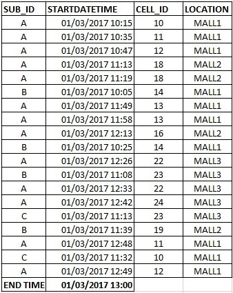
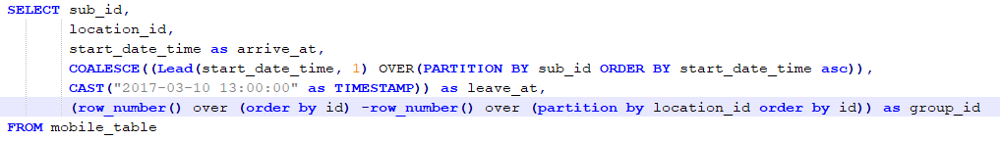
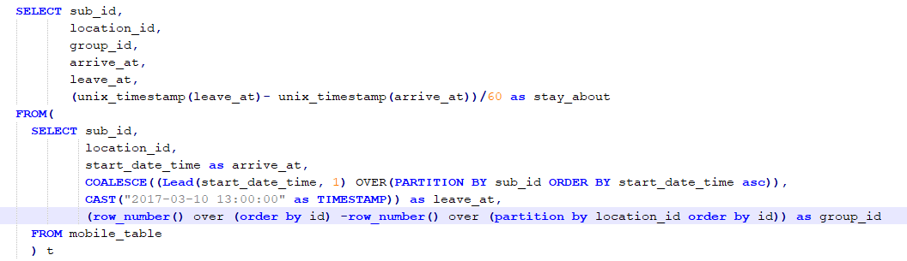
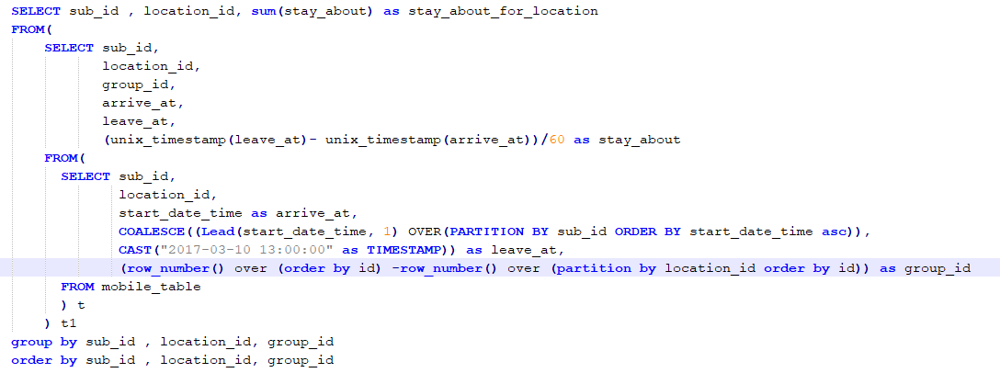
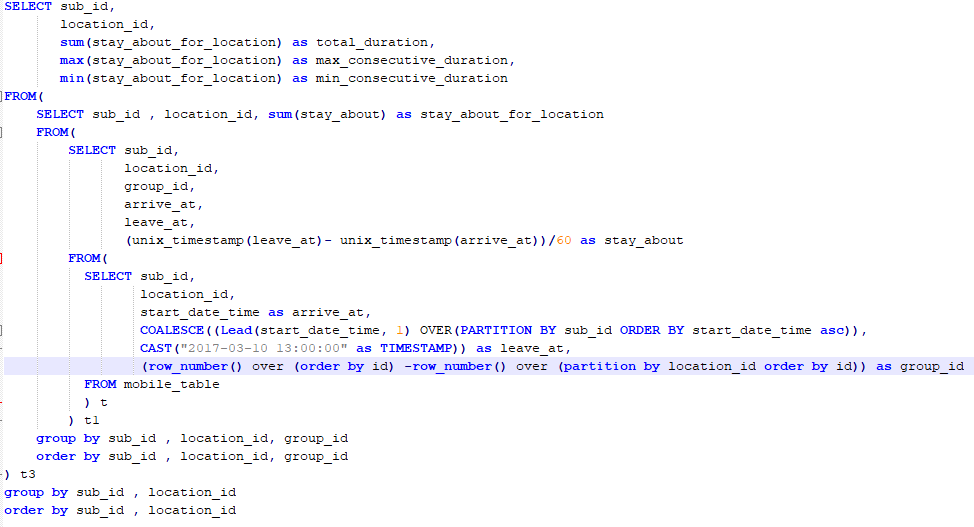
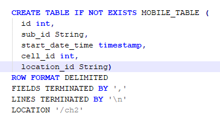
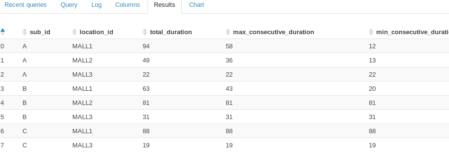

# Challenge(2)
Data Analysis
-----------------------------------------------
* The purpose of this task is to analyze the user location data with a particular time.

## Input:
-------------------------------
* The following example shows sample of the user location transaction for 3 users (A, B and C)
    *  **ID**: INT i assumed this column to represent the row id 
    * **SUB_ID** : String represents the subscriber id 
    * **STARTDATETIME** : TimeStamp represents the transaction timestamp
    * **CELL_ID** : INT represents the cell id
    * **LOCATION** : STRING represents the location id
   
**You will found the data sample file i used for the task "files/ch2_mock" in the ch2 directory**
    

## Assumption :
-----------------------------------------
1.	The user remains at the same location until you receive the next location update transaction for him 
2.	In case there is no next location update transaction consider the end time to be the last transaction time for all the users.
3.  I assumed that the end time to be hard coded in the script as i got confused how should it be represented in the input file but i can made another another assumption to avoid the hard coded end time by selecting the date of the last transaction in the table

## Task Description 
----------------------------------
* I stated the **arrive_at** time which is the start time of each transaction.
* I stated the **leave_at** time whish is start time of the next transaction.
* In **group_id** column For each user i organized the consecutive transactions at the same location to the same group for example the first 3 rows in the example will be assigned to group 0 and 2 rows after will be assigned to group 1 and so on.
* The following hardcoded end time i assumed it will be input to the script 
COALESCE((Lead(start_date_time, 1) OVER(PARTITION BY sub_id ORDER BY start_date_time asc)), CAST("2017-03-10 13:00:00" as TIMESTAMP))

But however we can avoid that by selecting the last transaction in the dataset by the following inner query 
 
**select start_date_time from mobile_table order by start_date_time desc limit 1**

* **stay_about** will calculate the period between every two consecutive transactions i converted the datetime to seconds to be easy to subtracted then i converted the difference to mintues

* **stay_about_for_location** Will calculate sum of each consecutive transactions for the user in specific locaiton

* **total_duration** will represents the total duration the user spent at specific location 
* **max_consecutive_duration** will maximum duration the user spent at specific location
* **min_consecutive_duration** will minimun duration the user spent at specific location

**Final Notes**
* I tried to avoid joins in this script due to it's bad performance and usually sub queries are faster.
* The Script is attached at the ch2 directory **script.txt**
* You can use the following script to create the table 

## Output:
---------------------------
* This is a sample of my script run output using the data file attached **"ch2_mock"**

